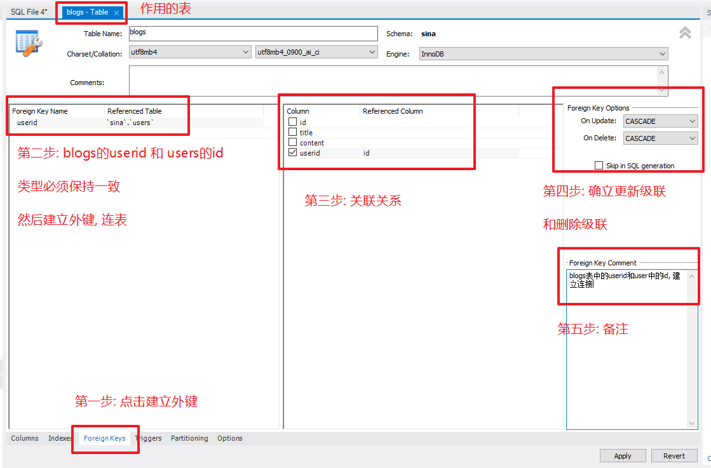
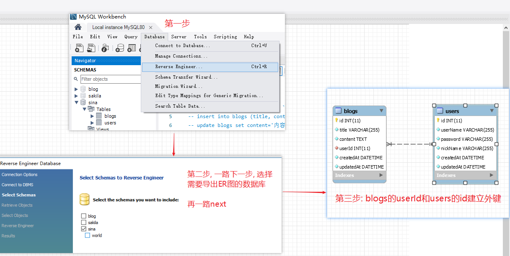
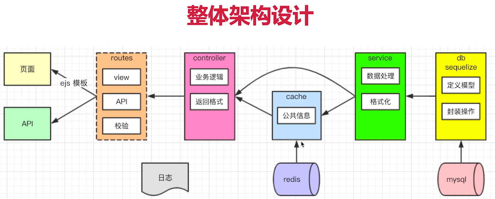
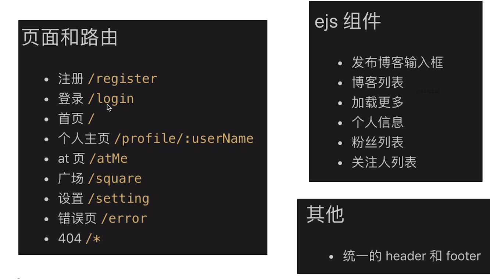
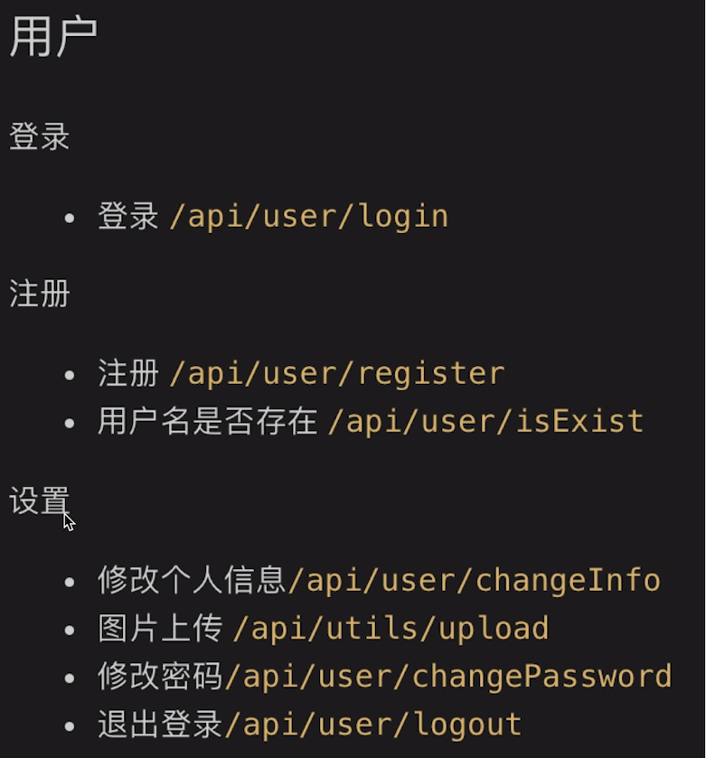
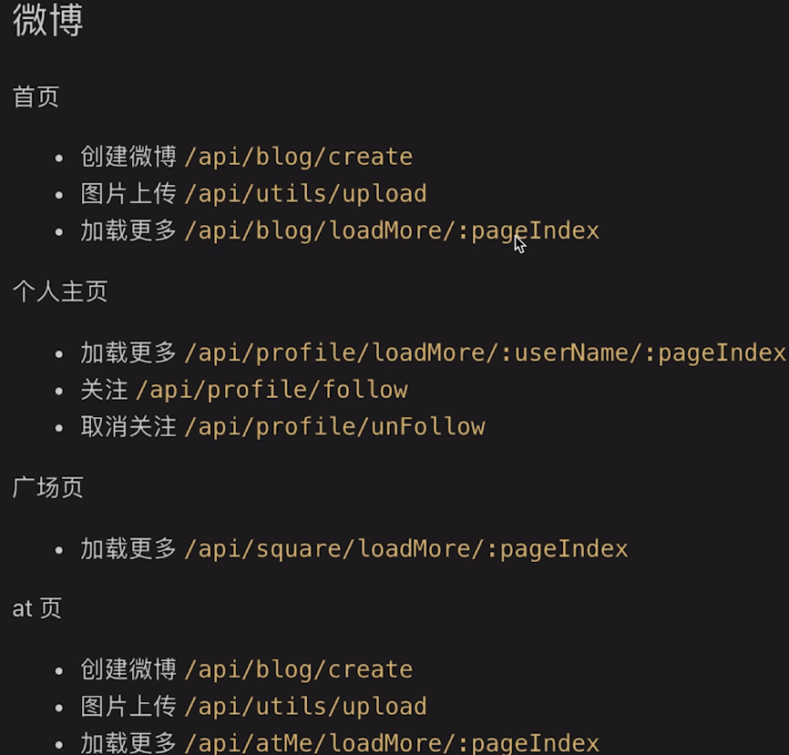
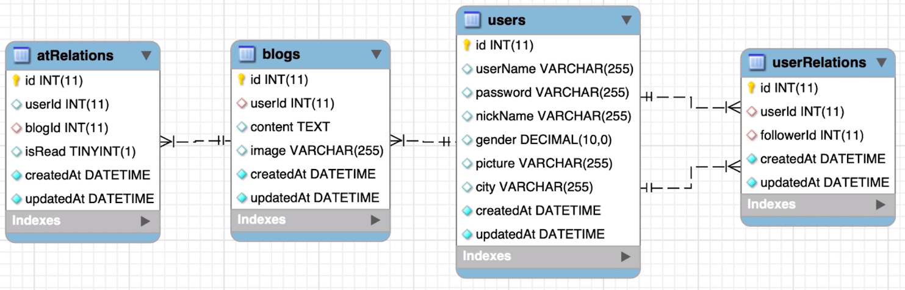

# KOA2(仿微博)

## 技术选型

1. 框架(koa2 vs express vs egg)
2. 前端页面(ejs vs react)
3. 数据库(mysql vs mongdb) - (mysql 和 sequlize)
4. 登录技术(session vs jwt)
5. 缓存数据库(redis)
6. 单元测试(jest)
7. 涉及到的安装包

   ```txt
     1. cross-env: 环境变量
     2. redis: redis连接
     3. koa-redis: koa连接redis
     4. koa-generic-session: koa生成session的工具
     5. jest: 开发环境下, 测试用例
     6. supertest: 开发环境下, 测试http接口
     7. mysql2: 连接mysql
     8. sequelize: orm工具, 对象关系映射, 操作mysql工具
     9. eslint: 代码规范
     10. pre-commit: 不符合eslint规范的, 不给于提交(项目工程化)
     11. koa-jwt: jwt的实现, token的验证
     12. jsonwebtoken: 实现用户数据的在server端的加密解密过程
     13: ajv: Another JSON Schema Validator, 校验规则
   ```

### KOA2

1. 安装: yarn global add koa-generator(yarn/npm)
2. 使用: koa2 -e koa-sina(-e 使用 ejs 模板引擎)

> tip 设置环境变量: cross-env NODE_ENV=dev

#### koa2 常用 Api

```txt
  1. ctx.body:
  2. ctx.request.body:
  3. ctx.query
  4. ctx.params
  5. ctx.session
  6. ctx.cookies
  7. ctx.redirect: 重定向
  8. ctx.url
```

#### koa2 路由

```js
// 前置路由
router.prefix('/api')
// 动态路由
router.get('/profile/:username/:page', async function (ctx, next) {
  // 获取动态路由参数
  const { username, page } = ctx.params
  ctx.body = { username, page }
})
// 路由合起来就是: /api/profile/zhangsan
```

### ejs

概念: 服务端模板渲染引擎, 类似的有 jade, art-template

#### ejs 语法

1. server 服务器

```js
// app.js中已经配置ejs模板引擎指向
router.get('/', async (ctx, next) => {
  // 指向ejs index, 传递变量title
  await ctx.render('index', {
    title: 'Hello Koa 2!',
    isMe: false,
    blogList: [
      {
        id: 1,
        title: '11',
      },
      {
        id: 2,
        title: '22',
      },
    ],
  })
})
```

##### 变量

```ejs
  <h1><%= title %></h1>
  <!-- 不确定是否传的locals, 到时候解析为空 -->
  <h1><%= locals.name %></h1>
```

##### 判断

ejs 模板使用判断和循环

```ejs
  <div>
    <% if (isMe) { %>
      <h1><%= title %></h1>
    <% } else {%>
      <h1>测试</h1>
    <% } %>
  </div>
```

##### 引用组件

```ejs
  <!-- 引入组件的路径 -->
  <%- include('view/index', {
    <!-- 传递到子组件参数 -->
    isMe
  }) %>
```

##### 循环

```ejs
  <ul>
    <% blogList.forEach(blog => { %>
      <li><%= blog.title %></li>
    <% }) %>
  </ul>
```

> ejs 组件内部(html)可以使用 script 标签写 js, ejs 本质就是 SSR(服务端渲染)

### MYSQL

#### 基础 SQL

1. 增(id 的自增不会考虑你删除的, 就只是一直增)

   ```sql
   -- 给某个表新增数据
   insert into users(username, `password`, realname) value('zhangshan', '123', '张三');
   ```

2. 删 一般不会真的删除, 只是多加字段 state, 1 代表存在, 0 代表不存在

   ```sql
   -- 清除所有的表
   delete from users;
   -- 清除某条数据
   delete from users where username='zhangshan';
   ```

3. 改 软删除, 只是更新状态

   ```sql
   -- 把所有数据realname都改成',lisi'
   update users set realname='lisi';
   -- 更新某条数据(可能会报错, 解决在5)
   update users set realname='lisi' where username='lisi';
   ```

4. 查

   ```sql
    -- 展示数据库的所有表
    show tables;
    -- 查询表中所有列, 慎用*, 影响性能
    select * from users;
    -- 查询列中某些列
    select id, username from users;
    -- 查询某条数据(交集)
    select * from users where username='zhangshan' and `password`='123';
    -- 查询并集
    select * from users where username='zhangshan' or `password`='123';
    -- 模糊查询
    select * from users where username like '%zhang%'
    -- 模糊查询,并排序(默认正序从小到大)
    select * from users where `password` like '%1%' order by id;
    -- 模糊查询,并排序(倒序)
    select * from users where `password` like '%1%' order by id desc;
    -- 不等于<>
    select * from users where state <> '0';
    -- 查询总数, 返回总数(sum: 4)
    select count(*) as sum from blogs
    select count(id) as sum from blogs
    -- 分页, limit 2 每页两行, offset 2, 跳过两行(即第二页日开始)
    select * from blogs by id desc limit 2 offset 2
    -- 连表查询(不一定非得外键约束), 不一定非得有userid.id=blogs.userid
    select * blogs inner join users on userid.id=blogs.userid
    -- 连表查询(不包含users的id), 加查询条件, 注意blogs.*
    select blogs.*, users.username, users.nickname from blogs
    inner join users on userid.id=blogs.userid
    where users.username = 'lisi'
   ```

5. 其他 sql 语句

   ```sql
   -- 执行一次, 更换换模式, 否则删除和修改会报错
   SET SQL_SAFE_UPDATES=0;
   -- 查询mysql版本, 当前版本 >= 5时, VARCHAR(10)时, 不论中文英文都是10个字符
   select version();
   -- 1=1 的用法是在搜索时, 保证哪怕没有其他搜索词, where也不会报错
   select * from blogs where 1=1
   ```

#### 外键

1. 创建外键(表和表建立连接)

2. 更新限制 & 删除级联 & 连表查询

   ```txt
       更新限制: 更新blogs的userid为一个users表中不存在的id, 更新不成功
       删除级联: 删除users中的某个用户, 用户关联的博客也会删除
       连表查询: 可以把连表数据一起查询
   ```

    

#### 导出 ER 图

  

#### 关系型数据库 三大范式

1. 属性的原子性: 每一列都不可再拆解(字段明晰)

2. 记录的唯一性: 有唯一标识(主键), 其他属性都依赖主键

3. 字段的冗余性: 不存在数据冗余和传递依赖(通过外键连接数据)

### sequelize(ORM 工具)

1. 概念: 对象关系映射, 通过操作对象的方式, 操作数据库(就是为了操作数据库)

   ```txt
     1. 数据表(table), 用js中的模型(class或对象) 代替
     2. 一条/多条数据, 用对象/数组代替
     3. sql语句, 用对象方法代替
   ```

2. 安装: `yarn add mysql2 sequlize`

3. 例子: demo -> sequelize-demo

#### 建模/建表(外键) & 同步到数据库

1. 创建 sequelize 对象

   ```js
   // seq.js
   const Sequelize = require('sequelize')
   const conf = {
     host: 'localhost',
     dialect: 'mysql', // 声明数据库类型
   }
   // 数据库名, 账户, 密码
   const seq = new Sequelize('sina', 'root', 'het@123', conf)
   module.exports = seq
   ```

2. 建模(建表 + 外键)

3. 同步到数据库

#### 增删改查(CRUD) & 连表查询

#### sequelize 连接池

1. 概念: 维持稳定数量的 sql 连接, 避免断/开反复的情况, 有助于系统稳定

2. 配置

```js
// 连接池配置, 线上环境, 比较稳定
// 开发环境需要暴露问题
conf.poor = {
  max: 5, // 连接池可连接的最大数量
  min: 0,
  idle: 1000, // 如果一个连接池 10s之内没有被使用, 就被释放
}
```

### jest(单元测试)

1. 概念: 单个功能/接口, 给定输入, 得到输出, 看输出是否复合要求

   ```js
     // yarn add jest
     // package.json -> scripts
     // runInBand: 按顺序执行
     // forceExit: 强制退出
     // colors: 按颜色输出, 可视化更好
     "test": "cross-env NODE_ENV=dev jest --runInBand --forceExit --colors"
   ```

2. 测试用例文件必须 `*.test.js`结尾

3. 常用断言

4. 测试 http 接口

### session-cookie 配置

1. 概念:
   1. 通过`koa-generic-session`和`koa-redis`, session 和 redis 能数据互通
   2. 设置 session 时, 数据自动同步到 redis 中, 同时也会设置 cookie
   3. cookie 中的 koa.sid -> 对应到 session 数据 -> 缓存到 redis 中 weibo.sess
   4. 判断登录, 就看 redis 中是否缓存有 username, 未登录时, 只存储 cookie 基础数据

```js
// 引入
const session = require('koa-generic-session') // 生成session
const redisStore = require('koa-redis') // 连接redis
const { REDIS_CONF } = require('./conf/db')

// session 配置, 需在router之前
app.keys = ['123'] // 密钥
app.use(
  session({
    key: 'weibo.sid', // cookie 的id 默认是koa.sid
    prefix: 'weibo.sess', // redis key 的前缀, 默认 koa:sess
    cookie: {
      path: '/',
      httpOnly: true,
      maxAge: 24 * 60 * 60 * 1000, // ms
    },
    // ttl: 24 * 60 * 60 * 1000, // redis 过期时间, 默认跟cookie过期时间一致
    store: redisStore({
      all: `${REDIS_CONF.host}:${REDIS_CONF.port}`,
    }),
  })
)
```

### JWT

1. 概念: json web token (jwt-demo)

   ```txt
     1. 用户认证成功之后, server端返回一个加密的token给客户端
     2. 客户端后续每次请求都带token, 以示用户身份
     3. 客户端每次请求, 都把token带上, 放在header authorization中
     4. 未带上token, 或者token过期的, 服务端返回401, 没有权限
     4. 用户信息存储在客户端, 故而不需要redis做用户信息缓存
   ```

2. koa2 实现 jwt

   ```js
   // yarn add koa-jwt 实现token验证, 即jwt
   // yarn add jsonwebtoken 实现token(用户数据)的加密解密

   // 第一步 app.js  使用jwt
   const jwtKoa = require('koa-jwt')
   const { SECRET } = require('./conf/constant')

   app.use(
     jwtKoa({
       secret: SECRET, // 密钥
     }).unless({
       path: [/^\/users\/login/], // 自定义哪些目录忽略jwt验证
     })
   )

   // 第二步 用户认证成功之后, server端返回一个加密的token给客户端
   // user.js 实现token(用户数据)的加密/解密
   const router = require('koa-router')()
   const jwt = require('jsonwebtoken') // token加密工具
   const { SECRET } = require('../conf/constant')
   const util = require('util') // node js自带的工具
   const verify = util.promisify(jwt.verify) // 把jwt加工成promise的方式
   // 伪代码, 登录成功, 拿到userInfo
   router.post('/login', async (ctx, next) => {
     let token
     if (userInfo) {
       // 设置token, 用户信息, 密钥. 过期时间
       token = jwt.sign(userInfo, SECRET, { expiresIn: '1h' })
     }
     // 返回token
     ctx.body = {
       errno: -0,
       data: token,
     }
   })

   // 第三步 能把客户端返回的token解析成未加密的用户信息
   // 客户端每次请求token 都放在header的 authorization中
   const token = ctx.header.authorization
   try {
     const payload = await verify(token.split(' ')[1], SECRET)
     ctx.body = {
       errno: 0,
       userInfo: payload,
     }
   } catch (error) {}
   ```

3. jwt 和 session-cookie 异同

```txt
区别
  jwt: 用户信息加密存储在客户端, 不依赖cookie, 可跨域, 更适合服务节点多
      不需要redis工具, 登录未过期之前, 服务端无法清除登录

  session-cookie: 用户信息存储在服务端, 依赖cookie, 不可跨域, 适合统一web服务, server端严格管理用户信息

共同
  实现登录验证, 大型系统中两者可共用, 并无明显好坏
```

### koa 开发环境的搭建

## 项目

### 项目设计

1. 架构图

    

2. 页面设计图

    

3. 路由设计
    <div style="overflow: hidden">
      

      
    </div>

4. 数据模型设计(ER图)

    

### 用户管理(登录注册)

1. git checkout -b feature-login

2. ajv的使用

```js
  // schema: 校验规则
  // data: 需要校验的数据
  var valid = ajv.validate(schema, data);
  if (!valid) console.log(ajv.errors);
```

### 用户设置(基本信息, 修改密码, 退出登录)

### 创建微博

### 个人主页

### 广场页(缓存)

### 关注和取消关注

### 首页

### @ 和回复

### @ 提到我
